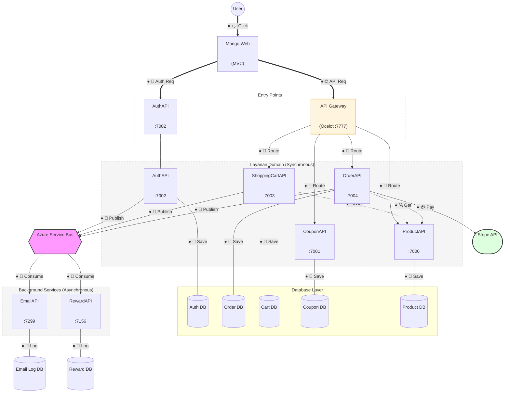
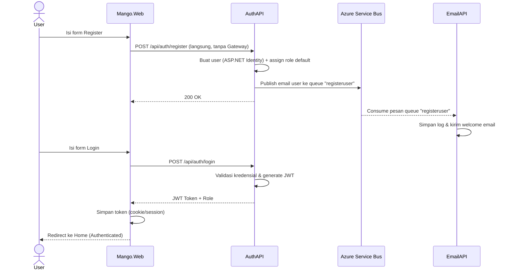
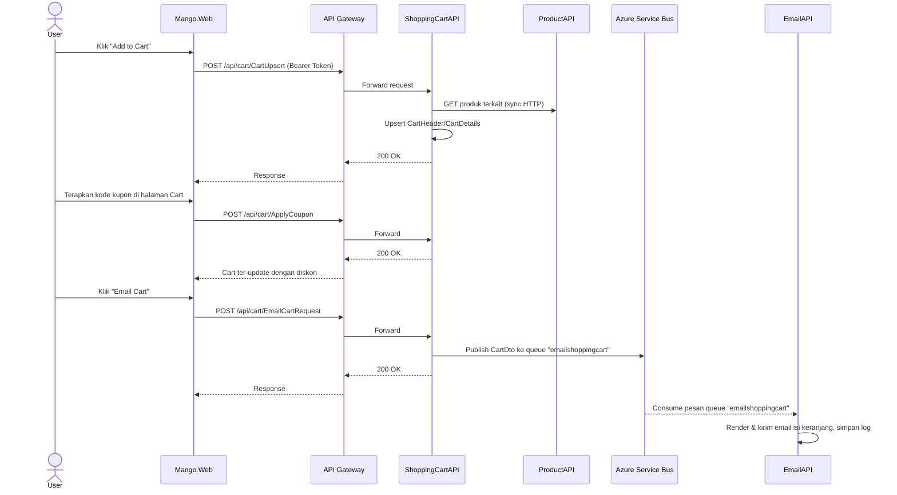
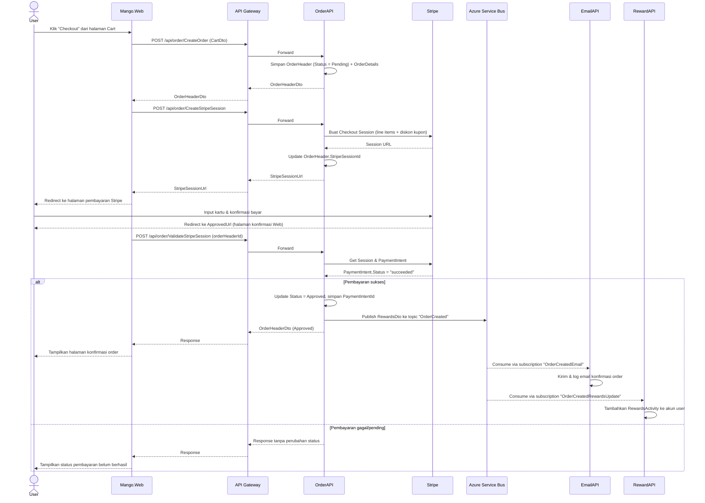

# Mango Microservices

Aplikasi e-commerce berbasis **.NET 8** dengan arsitektur microservices, API Gateway (Ocelot), komunikasi asynchronous via **Azure Service Bus**, dan pembayaran melalui **Stripe**.

> Referensi belajar:
> - Introduction to .NET Microservices (.NET 8) — https://www.youtube.com/watch?v=Nw4AZs1kLAs
> - https://github.com/bhrugen/Mango_Microservices

## Daftar Isi

- [Arsitektur Sistem](#arsitektur-sistem)
- [Daftar Layanan](#daftar-layanan)
- [Pola Komunikasi](#pola-komunikasi)
- [Alur Registrasi & Login](#alur-registrasi--login)
- [Alur Keranjang Belanja & Email Cart](#alur-keranjang-belanja--email-cart)
- [Alur Checkout, Pembayaran, & Reward](#alur-checkout-pembayaran--reward)
- [Pemetaan Topic & Queue Service Bus](#pemetaan-topic--queue-service-bus)
- [Menjalankan Proyek](#menjalankan-proyek)

## Arsitektur Sistem



### Keterangan Diagram Arsitektur

Untuk memudahkan pembacaan diagram di atas, berikut adalah penjelasan mengenai komponen visual yang digunakan:

#### 1. Penjelasan Layer (Lapisan)
Diagram disusun secara vertikal untuk menunjukkan aliran data dari atas ke bawah:
- **Client Layer (Atas)**: Titik awal interaksi pengguna melalui browser dan frontend `Mango.Web`.
- **Entry Point Layer**: Pintu masuk request ke sistem. `API Gateway` mengelola routing untuk sebagian besar layanan, sementara `AuthAPI` diakses langsung untuk proses autentikasi.
- **Domain Layer (Synchronous)**: Kumpulan microservices yang menangani logika bisnis utama dan merespons request secara langsung (real-time).
- **Database Layer (Bawah)**: Lapisan persistensi data di mana setiap layanan memiliki database terisolasi sendiri (Database-per-Service).
- **Async/Background Layer (Samping)**: Layanan yang bekerja secara asynchronous. Mereka tidak menunggu request dari user, melainkan bereaksi terhadap event yang masuk melalui `Azure Service Bus`.

#### 2. Penjelasan Jenis Garis & Marker (Edges)
Untuk menciptakan simetri visual (titik awal dan titik akhir), setiap garis menggunakan sistem marker berikut:
- **Titik Akhir**: Ditandai dengan **Panah** (simbol standar Mermaid) yang menunjukkan arah aliran data.
- **Titik Awal**: Ditandai dengan simbol **`●` (Black Circle)** pada label garis. Simbol ini berfungsi sebagai "titik start" untuk mengidentifikasi asal aksi:
    - **Garis Tebal (`==>`)**: Alur trafik utama.
        - `● 👉` (Click): Interaksi awal user.
        - `● 🌐` (API Req): Request menuju Gateway.
        - `● 🔑` (Auth Req): Request menuju AuthAPI.
    - **Garis Panah Standar (`-->`)**: Komunikasi **Synchronous HTTP**.
        - `● 🎯` (Route): Pengalihan traffic oleh Gateway ke layanan tujuan.
    - **Garis Putus-putus (`-.->`)**: Dependensi internal.
        - `● 🔍` (Get): Proses permintaan data antar-layanan.
    - **Garis Event (`-- "Event" -->`)**: Komunikasi **Asynchronous**.
        - `● 🔔` (Publish): Pengiriman event ke Message Broker.
        - `● 📩` (Consume): Penerimaan pesan oleh consumer.
    - **Garis Lurus Sederhana (`---`)**: Koneksi database.
        - `● 💾` (Save/Log): Proses persistensi data ke storage.

#### 3. Penjelasan Warna & Simbol
- **Warna Kuning (`GW`)**: Menandai komponen *Edge/Gateway* yang menjadi pengatur lalu lintas.
- **Warna Ungu (`SB`)**: Menandai *Message Broker* sebagai pusat distribusi event.
- **Warna Hijau (`Stripe`)**: Menandai integrasi dengan layanan pihak ketiga (External API).
- **Kotak Putus-putus**: Menandai pengelompokan logis layanan berdasarkan tipe komunikasinya (Sync vs Async).


Ciri arsitektur:
- **Mango.Web** adalah satu-satunya entry point untuk user (browser). Login/Register memanggil `AuthAPI` **langsung** (tidak lewat Gateway), sedangkan semua fitur lain (Product, Coupon, Cart, Order) melewati **API Gateway (Ocelot)**.
- **EmailAPI** dan **RewardAPI** tidak diakses langsung oleh Web/Gateway — keduanya murni **background message consumer** yang bereaksi terhadap event dari Service Bus.
- Komunikasi antar layanan domain (mis. Cart/Order memanggil Product) dilakukan secara **synchronous via HTTP**, sedangkan efek samping (kirim email, update reward) dilakukan secara **asynchronous via Azure Service Bus** agar layanan tidak saling blocking/coupling.

## Daftar Layanan

| Layanan | Port (HTTPS) | Tanggung Jawab | Autentikasi |
|---|---|---|---|
| `Mango.GatewaySolution` | 7777 | Reverse proxy (Ocelot) ke Product/Coupon/Cart/Order | - |
| `Mango.Services.AuthAPI` | 7002 | Register, Login, JWT, manajemen role (ASP.NET Identity) | Diakses langsung oleh Web |
| `Mango.Services.ProductAPI` | 7000 | CRUD Produk | Bearer (write only) |
| `Mango.Services.CouponAPI` | 7001 | CRUD Kupon diskon | Bearer (write only) |
| `Mango.Services.ShoppingCartAPI` | 7003 | Cart header/detail, apply coupon, request email cart | Bearer |
| `Mango.Services.OrderAPI` | 7004 | Buat order, integrasi Stripe, publish event pembayaran sukses | Bearer |
| `Mango.Services.EmailAPI` | 7299 | Consumer: kirim & log email (welcome, cart, konfirmasi order) | - (internal) |
| `Mango.Services.RewardAPI` | 7156 | Consumer: update poin reward user setelah order sukses | - (internal) |
| `Mango.Web` | - | Frontend MVC | Cookie + JWT ke API |

## Pola Komunikasi

| Pola | Digunakan Untuk | Teknologi |
|---|---|---|
| Synchronous request/response | Web ↔ Gateway ↔ Services, Cart/Order → Product | HTTP/HTTPS + `IHttpClientFactory` |
| Asynchronous pub/sub | Notifikasi email, update reward setelah order | Azure Service Bus (Queue & Topic/Subscription) |
| Payment redirect | Checkout pembayaran | Stripe Checkout Session |

## Alur Registrasi & Login



## Alur Keranjang Belanja & Email Cart



## Alur Checkout, Pembayaran, & Reward



## Pemetaan Topic & Queue Service Bus

| Nama Topic/Queue | Tipe | Publisher | Subscriber | Payload |
|---|---|---|---|---|
| `registeruser` | Queue | AuthAPI | EmailAPI | `string` (email) |
| `emailshoppingcart` | Queue | ShoppingCartAPI | EmailAPI | `CartDto` |
| `OrderCreated` (subscription `OrderCreatedEmail`) | Topic | OrderAPI | EmailAPI | `RewardsDto` |
| `OrderCreated` (subscription `OrderCreatedRewardsUpdate`) | Topic | OrderAPI | RewardAPI | `RewardsDto` |

Satu event `OrderCreated` di-broadcast ke **dua subscriber berbeda** (fan-out) sehingga EmailAPI dan RewardAPI dapat memproses pesan yang sama secara independen tanpa saling mengetahui satu sama lain.

## Menjalankan Proyek

### Build

```bash
dotnet build Mango.sln
```

### Jalankan (Run)

Lihat skill `run` untuk instruksi detail: `/run` (atau cek `.claude/skills/run.md`).

## Panduan Coding

- Ikuti standar idiom .NET 8.
- Gunakan Dependency Injection untuk service dan repository.
- Jaga pemisahan tanggung jawab (Separation of Concerns) antara lapisan API dan lapisan Domain.
- Untuk setiap layanan baru, pastikan telah ditambahkan ke `Mango.sln` dan dikonfigurasi di `Mango.GatewaySolution` (`ocelot.json`).

## Database

Sebagian besar layanan menggunakan Entity Framework Core. Periksa folder `Data` di setiap layanan untuk menemukan `AppDbContext`.
